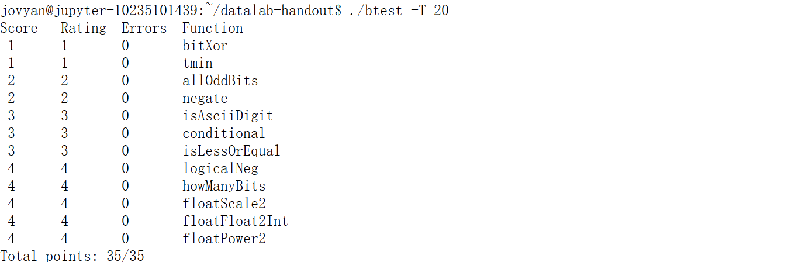
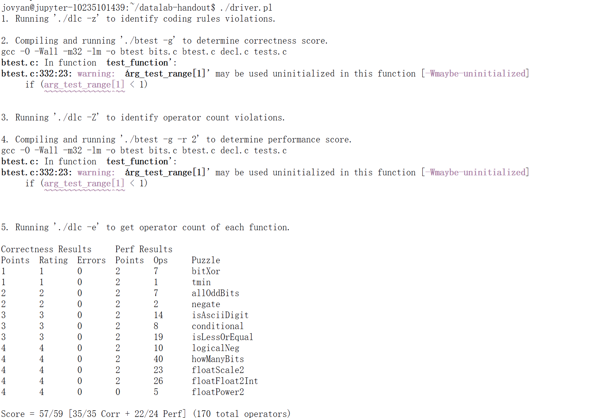

# CSAPP:datalab
## 代码思路
以下分函数介绍代码思路
### bitXor
---

```c
/*
 * bitXor - x^y using only ~ and &
 *   Example: bitXor(4, 5) = 1
 *   Legal ops: ~ &
 *   Max ops: 14
 *   Rating: 1
 */
int bitXor(int x, int y)
{
    return (~(x & y)) & (~((~x) & (~y)));
}
```
对于`x`和`y`的每一个对应的位来说：`~(x&y)`排除两个位均为1的情况，`~((~x)&(~y))`排除两个位均为0的情况。

### tmin
---

```c
/*
 * tmin - return minimum two's complement integer
 *   Legal ops: ! ~ & ^ | + << >>
 *   Max ops: 4
 *   Rating: 1
 */
int tmin(void)
{
    return 1 << 31;
}
```
由于实验默认int为32位， $T_{min}$ = `0x80000000` 。

### isTmax
---

```c
/*
 * isTmax - returns 1 if x is the maximum, two's complement number,
 *     and 0 otherwise
 *   Legal ops: ! ~ & ^ | +
 *   Max ops: 10
 *   Rating: 1
 */
int isTmax(int x)
{
    int y = x + 1;
    int negY = ~y + 1;
    return !(y ^ negY) & (!!y);
}
```
注意到 $T_{max}+1==T_{min}$ ，而 $T_{min}$ 的相反数仍是本身，满足相反数等于本身的只有 $0$ 和 $T_{min}$ ，我们首先保证该数相反数等于本身，之后将-1排除即可(`-1+1==0`)。

### allOddBits
---

```c
/*
 * allOddBits - return 1 if all odd-numbered bits in word set to 1
 *   where bits are numbered from 0 (least significant) to 31 (most significant)
 *   Examples allOddBits(0xFFFFFFFD) = 0, allOddBits(0xAAAAAAAA) = 1
 *   Legal ops: ! ~ & ^ | + << >>
 *   Max ops: 12
 *   Rating: 2
 */
int allOddBits(int x)
{
    // 0B10101010
    int mask = 0xAA;
    mask = mask | (mask << 8);
    mask = mask | (mask << 16);
    return !(mask ^ (mask & x));
}
```
由于限制常数只能在0~255之间，我们首先为`mask`赋值`0xAA`，然后构造出`0xAAAAAAAA`，最后用`mask&x`提取所有偶数位信息，判断结果是否为`0xAAAAAAAA`（即：`x`的所有偶数位都被置位而所有奇数位均未被置位）。

### negate
---

```c
/*
 * negate - return -x
 *   Example: negate(1) = -1.
 *   Legal ops: ! ~ & ^ | + << >>
 *   Max ops: 5
 *   Rating: 2
 */
int negate(int x)
{
    return ~x + 1;
}
```
补码的性质：`-x=~x+1`。

### isAsciiDigit
---

```c
/*
 * isAsciiDigit - return 1 if 0x30 <= x <= 0x39 (ASCII codes for characters '0' to '9')
 *   Example: isAsciiDigit(0x35) = 1.
 *            isAsciiDigit(0x3a) = 0.
 *            isAsciiDigit(0x05) = 0.
 *   Legal ops: ! ~ & ^ | + << >>
 *   Max ops: 15
 *   Rating: 3
 */
int isAsciiDigit(int x)
{
    int mask = 0x3F;
    int negX = ~x + 1;
    int sgnMask = 1 << 31;
    int outRange = (sgnMask & (x + (~0x30 + 1))) | (sgnMask & (0x39 + negX));
    return !(((mask & x) ^ x) | outRange);
}
```
由于题目限制不可以使用减号，因此使用取反加一的操作构造出`-x`和`-0x30`，计算`0x39-x`和`x-0x30`并判断是否均非负（通过符号位判断），若均为正，则 $0x30 \le x \le 0x39$ ，即，x是ASCII Digit。

### conditional
---

```c
/*
 * conditional - same as x ? y : z
 *   Example: conditional(2,4,5) = 4
 *   Legal ops: ! ~ & ^ | + << >>
 *   Max ops: 16
 *   Rating: 3
 */
int conditional(int x, int y, int z)
{
    int m = (!(!x)) << 31;
    m = m >> 31;
    return (m & y) | ((~m) & z);
}
```
两次逻辑非判断`x`的真值，为真则`m`被全部置为1，`m&y==y`且`(~m)&z==0`，否则`m`被全部置为0，`m&y==0`且`(~m)&z==z`。由此达到`x?y:z`的效果。

### isLessOrEqual
---

```c
/*
 * isLessOrEqual - if x <= y  then return 1, else return 0
 *   Example: isLessOrEqual(4,5) = 1.
 *   Legal ops: ! ~ & ^ | + << >>
 *   Max ops: 24
 *   Rating: 3
 */
int isLessOrEqual(int x, int y)
{
    int m = 1 << 31;
    int negXposY = ((m & x) & (~y)) >> 31;
    int negYposX = ((m & y) & (~x)) >> 31;
    int negY = (~y + 1);
    int less = (x + negY) >> 31;
    int equal = !(x ^ y);
    return (!negYposX) & (negXposY | less | equal);
}
```
分以下几种情况考虑：
* `x<0 且 y>0`，则必然为真
* `x>0 且 y<0`，则必然为假
* `x,y同号`，则直接相减判断大小，因为在这种情况下必然不会发生溢出，因此可以直接判断符号位来判断大小关系

### logicalNeg
---

```c
/*
 * logicalNeg - implement the ! operator, using all of
 *              the legal operators except !
 *   Examples: logicalNeg(3) = 0, logicalNeg(0) = 1
 *   Legal ops: ~ & ^ | + << >>
 *   Max ops: 12
 *   Rating: 4
 */
int logicalNeg(int x)
{
    int isZeroOrTmin = ~(x ^ (~x + 1));
    int isTmin = (1 << 31) & x;
    return 1 & ((isZeroOrTmin & (~isTmin)) >> 31);
}
```
类似于之前的`isTmax`，只有0和 $T_{min}$ 的相反数等于他们本身，这次我们判断相反数是否等于本身并排除 $T_{min}$ 这种情况

### howManyBits
---

```c
/* howManyBits - return the minimum number of bits required to represent x in
 *             two's complement
 *  Examples: howManyBits(12) = 5
 *            howManyBits(298) = 10
 *            howManyBits(-5) = 4
 *            howManyBits(0)  = 1
 *            howManyBits(-1) = 1
 *            howManyBits(0x80000000) = 32
 *  Legal ops: ! ~ & ^ | + << >>
 *  Max ops: 90
 *  Rating: 4
 */
int howManyBits(int x)
{
    int signMask = x >> 31;
    int y = (signMask ^ x); // bit nor only for negs
    int sum = 0;
    sum += !!(y & ((0xFF << 24) + (0xFF << 16))) << 4;
    sum += !!(y & ((0xFF << 8) << sum)) << 3;
    sum += !!(y & (0xF0 << sum)) << 2;
    sum += !!(y & (0xC << sum)) << 1; // C:1100
    sum += !!(y & (0x2 << sum));
    sum += !!(y & (0x1 << sum));
    return sum + 1;
}
```
使用二分法，我们根据补码的性质将问题转换为：若x为正数，则找出他位数最高的1，若x为负数，则找出他位数最高的0，原理和截断以及算术右移类似，即，正数最前面的连续0序列可以忽略，负数最前面的连续1序列可以忽略。e.g.`0111 == 0000 0111` `10 == 1111 1110`这样，我们忽略掉前面的连续序列即可获得所需位数。
对负数，我们首先将其按位取反，这样便能和正数一样处理。我们可以使用二分法找出最前面的1。我们先使用`0xFFFF0000`判断前面16位是否有1，若有，则后面在 16~31 位之间寻找，若无，则在 0~15 位之间寻找。连续的使用二分，直至将搜索区间缩至一位，这一位即为我们所要寻找的位数最高的1。最后，由于符号位的存在，我们需要返回`sum+1`。

### floatScale2
---

```c
/*
 * floatScale2 - Return bit-level equivalent of expression 2*f for
 *   floating point argument f.
 *   Both the argument and result are passed as unsigned int's, but
 *   they are to be interpreted as the bit-level representation of
 *   single-precision floating point values.
 *   When argument is NaN, return argument
 *   Legal ops: Any integer/unsigned operations incl. ||, &&. also if, while
 *   Max ops: 30
 *   Rating: 4
 */
unsigned floatScale2(unsigned uf)
{
    int sign = (1 << 31) & uf;
    int exp = ((1u << 31) - (1u << 23)) & uf;
    int frac = ((1 << 23) - 1) & uf;
    exp = exp >> 23;

    if (exp == 0xff)
        return uf;
    else if (exp == (0xff - 1))
        return sign | ((exp + 1) << 23); // inf
    else if (exp == 0)
        return sign | (frac << 1);
    else
        return sign | ((exp + 1) << 23) | frac;
}
```
首先将uf分解成`sign bit` `exp` `frac`三部分，然后判断操作后是否为inf，原操作数是否为非规格化数进行特殊处理，否则直接让exp+1即可。

### floatFloat2Int
---

```c
/*
 * floatFloat2Int - Return bit-level equivalent of expression (int) f
 *   for floating point argument f.
 *   Argument is passed as unsigned int, but
 *   it is to be interpreted as the bit-level representation of a
 *   single-precision floating point value.
 *   Anything out of range (including NaN and infinity) should return
 *   0x80000000u.
 *   Legal ops: Any integer/unsigned operations incl. ||, &&. also if, while
 *   Max ops: 30
 *   Rating: 4
 */
int floatFloat2Int(unsigned uf)
{
    unsigned inf = 0x80000000u;
    int sign;
    int exp = (((1u << 31) - (1u << 23)) & uf) >> 23;
    int bias = 127;
    int frac = (((1 << 23) - 1) & uf) + (1 << 23);
    //check sign bit
    if (uf & (1 << 31))
    {
        sign = -1;
    }
    else
    {
        sign = 1;
    }
    //  norm
    if (exp >= bias + 53)
    {
        return inf;
    }
    else if (exp >= bias + 22)
    {
        return (frac << (exp - bias - 23)) * sign;
    }
    else if (exp >= bias)
    {
        return (frac >> (bias + 23 - exp)) * sign;
    }
    else // 小于1
    {
        return 0;
    }
}
```
首先判断正负，然后分`inf` `0`以及一般情况处理。

### floatPower2
---

```c
/*
 * floatPower2 - Return bit-level equivalent of the expression 2.0^x
 *   (2.0 raised to the power x) for any 32-bit integer x.
 *
 *   The unsigned value that is returned should have the identical bit
 *   representation as the single-precision floating-point number 2.0^x.
 *   If the result is too small to be represented as a denorm, return
 *   0. If too large, return +INF.
 *
 *   Legal ops: Any integer/unsigned operations incl. ||, &&. Also if, while
 *   Max ops: 30
 *   Rating: 4
 */
unsigned floatPower2(int x)
{
    unsigned bias = 127u;
    unsigned inf = 0x7f800000u;
    if (x > 127)
    {
        return inf;
    }
    else if (x < -126)
    {
        return 0;
    }
    else
    {
        return (bias + x) << 23;
    }
}
```
首先判断结果是否过大或者过小，否则直接返回结果。由于 $2^x == 1\times2^x$，我们直接操作exp并为frac置零即可（实验规定只考虑规格化的数值）

## 结果截图
* btest:

* driver.pl:

