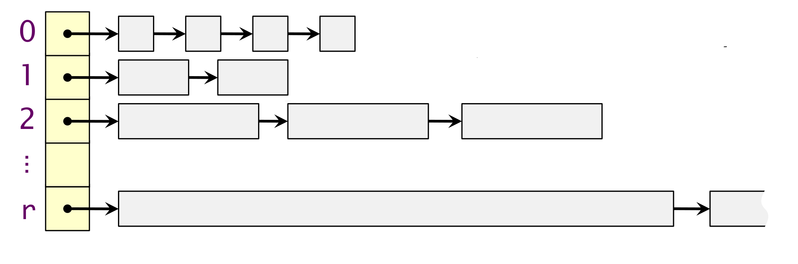
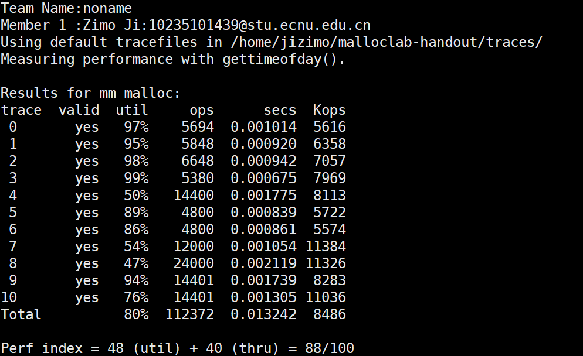

# Malloc Lab

## 任务要求

该lab要求我们使用提供的模拟sbrk函数(`mem_sbrk`)实现`malloc`,`free`,`realloc`操作。

## 思路

### 空闲块管理方式

我们使用分离的显式链表(Segregated free list)实现上述函数，原理如图所示：


该结构可以看作是一个哈希表，将大小在某一区间内的块放置在同一个槽中，并使用链表进行管理，这样可以较大地提升搜索可用块的效率。这一方式与linux中的buddy system有相似之处，不同点在于buddy system中的内存块严格按照$2^k$对齐，该结构中的各个块则可以是任意长度（但是按照题目要求需要8字节对齐），这样的实现使得操作速度略有下降，但是极大地提升了内存的利用率。

### 块的结构
不同于CSAPP中官方给出的块结构，我自己定义了块结构如下：

首尾的两个元素各占8字节（指针4字节，有效位及块大小4字节）,这样能保证每个块以及用户的负载开头均为8字节对齐，方便其后的coalsce操作。

* Next Block Pointer: 指向链表中的下一个块头部。
* Available Bit & Size: 该字段的最高位指示该块是否处于可用状态（是否位于内存池中等待被分配给用户），其后的各个位大小指定了该块的**有效载荷**的大小。块的总大小为有效载荷大小+16，这点在`extend_heap`函数中体现了出来。
* Prev Block Pointer: 指向链表中的上一个块头部。

这样，每一个块都是双向链表中的一个节点。

另外，我创建了一个数组，保存指向各个分离的链表头部的指针。同时使用下面这个哈希函数来判断将特定大小的可用块放置到哪一个链表中。
``` c
int hash(size_t n)
{
    if (n < 16)
    {
        return 0;
    }
    else if (n < 32)
    {
        return 1;
    }
    else if (n < 64)
    {
        return 2;
    }
    else if (n < 128)
    {
        return 3;
    }
    else if (n < 256)
    {
        return 4;
    }
    else if (n < 512)
    {
        return 5;
    }
    else if (n < 1024)
    {
        return 6;
    }
    else if (n < 2048)
    {
        return 7;
    }
    else if (n < 4096)
    {
        return 8;
    }
    else if (n < 8192)
    {
        return 9;
    }
    else
    {
        return 10;
    }
}
```

由上可以看出，我们将有效载荷在0\~15之间的块放置在第0个槽，16\~31放置在第1个槽，32\~64放置在第2个槽，依次类推，当块大小超过8192时，我们将他放置在最后一个槽中。

## 代码实现

### 工具函数
~~由于没有注意到课本中的相关工具宏~~ 由于块的结构与课本中的不一致，我自己实现了一系列对内存和块进行操作的函数和宏：
``` c
#define FLAG_BYTE(block) (*((size_t *)(block) + 1))
#define FOOT_FLAG_BYTE(block) *((size_t *)foot_pointer(block) - 1)

size_t get_block_size(void *block)
{
    if (block == NULL)
        return 0;
    return FLAG_BYTE(block) & SIZE_MASK;
}

void set_block_size(void *block, size_t size)
{
    FLAG_BYTE(block) = size;
    size_t *foot_flag = (size_t *)((char *)block + ALIGNMENT + size);
    *foot_flag = size;
    *(void **)((size_t *)foot_flag + 1) = NULL;
    *(void **)block = NULL;
}

void available(void *block)
{
    assert(!check_available(block));
    FLAG_BYTE(block) |= AVAIL_BIT_MASK;
    FOOT_FLAG_BYTE(block) |= AVAIL_BIT_MASK;
}

void unavailable(void *block)
{
    assert(check_available(block));
    FLAG_BYTE(block) &= SIZE_MASK;
    FOOT_FLAG_BYTE(block) &= SIZE_MASK;
}

int check_available(void *block)
{
    if (block == NULL)
        return 0;
    return (FLAG_BYTE(block) & AVAIL_BIT_MASK);
}

void *foot_pointer(void *block)
{
    if (block == NULL)
        return NULL;
    return (void *)((char *)block + ALIGNMENT + get_block_size(block) + sizeof(size_t));
}

void *next_block(void *block)
{
    return *(void **)block;
}

void *prev_block(void *block)
{
    if (block == NULL)
        return NULL;
    size_t size = get_block_size(block);
    void *foot_info = (char *)block + size + ALIGNMENT + sizeof(size_t);
    return *(void **)foot_info;
}
```

### detach & attach

这两个函数完成了对分离链表的操作和空闲块的分配和管理，对于一个块，当它为空闲（available）状态时，则使用   `attach`分配到分离链表中，当我们需要将某个块分配给调用者，或是需要进行分离，合并等操作时（这些操作的共同点是调用了`set_block_size`函数）需要使用`detach`函数使其与分离链表分离。空闲块的可用位只能由这两个函数修改，这样做的好处是避免了内存管理的混乱，造成可用负载的重叠或是段错误。下列是相关代码：
``` c
void attach(void *block)
{
    assert(prev_block(block) == NULL && next_block(block) == NULL);
    assert(block != NULL);
    assert(!check_available(block));
    // assert(get_block_size(block) < 65536);
    int slot_idx = hash(get_block_size(block));
    // assert(*(void **)foot_pointer(mem_pool_head[slot_idx]) == NULL);
    void *const next = mem_pool_head[slot_idx];
    void *const block_foot = foot_pointer(block);
    *(void **)block_foot = NULL;

    if (next == NULL)
    {
        mem_pool_head[slot_idx] = block;
        void *foot = foot_pointer(block);
        *(void **)foot = NULL;
    }
    else
    {
        *(void **)block = mem_pool_head[slot_idx];
        void *next_foot = foot_pointer(mem_pool_head[slot_idx]);
        *(void **)next_foot = block;
        mem_pool_head[slot_idx] = block;
    }
    assert(prev_block(mem_pool_head[slot_idx]) == NULL);

    available(block);
}

/*
 * Detach the block from the linked list.
 */
void detach(void *block)
{
    assert(block != NULL);
    assert(check_available(block));
    int slot_idx = hash(get_block_size(block));
    // assert(*(void **)foot_pointer(mem_pool_head[slot_idx]) == NULL);
    void *prev = prev_block(block);
    void *next = next_block(block);
    void *foot = foot_pointer(block);

    if (prev == NULL && next == NULL)
    {
        mem_pool_head[slot_idx] = NULL;
    }
    else if (prev != NULL && next == NULL)
    {
        *(void **)prev = NULL;
    }
    else if (prev == NULL && next != NULL)
    {
        void *next_foot = foot_pointer(next);
        mem_pool_head[slot_idx] = next;
        *(void **)next_foot = NULL;
    }
    else
    {
        void *next_foot = foot_pointer(next);
        *(void **)prev = next;
        *(void **)next_foot = prev;
    }
    assert(prev_block(mem_pool_head[slot_idx]) == NULL);
    *(void **)block = NULL;
    *(void **)foot = NULL;

    unavailable(block);
    assert(prev_block(block) == NULL && next_block(block) == NULL);
}
```

除去对available的操作，`attach`和`detach`的操作就是对双向链表的插入和删除操作，其中`attach`操作直接将空闲块插入到链表的头部并将块设置为可用，`detach`从块从链表中删除并设置为不可用。

### mm_init

初始化分离链表的槽，将每个槽都置为NULL表示当前为空。
``` c
int mm_init(void)
{
    for (int i = 0; i < MAX_SLOT; ++i)
    {
        mem_pool_head[i] = NULL;
    }
    return 0;
}
```

### mm_malloc

模拟标准库的malloc操作，使用`first_available`函数找到满足要求的第一个可用块，将用户负载返回给用户。
``` c
void *mm_malloc(size_t size)
{
    size_t total_size = ALIGN(size);
    void *block = first_available(total_size);
    return (void *)((char *)block + ALIGNMENT);
}
```

其中`first_available`函数包含了找出可用块的关键逻辑：

### first_available

``` c
void *first_available(size_t size)
{
    int slot_idx = hash(size);
    void *block = mem_pool_head[slot_idx];
    // First, search current slot
    while (block != NULL)
    {
        if (get_block_size(block) >= size)
        {
            return split_block(block, size);
        }
        else
        {
            block = next_block(block);
        }
    }
    // Second, find the first larger block to split
    for (int i = slot_idx + 1; i < MAX_SLOT; ++i)
    {
        if (mem_pool_head[i] != NULL)
        {
            return split_block(mem_pool_head[i], size);
        }
    }
    // If none of them are available, init a new block
    block = extend_heap(size);

    return block;
}
```

整个代码可分为三个部分：
* 获取`size`对应的槽索引，检查该索引下有无空闲可用块能够容下`size`大小的用户负载
* 如果上一步没有找到，则找到第一个非空的槽，分割并分配该槽中的第一个可用块，`hash`函数保证了这个块一定能够容得下`size`大小的用户负载。
* 如果还是找不到，则说明当前的空闲块中无适合的块，调用`extend_heap`分配一个新的空闲块。

经过上述三步后获取一个可用块返回，`first_available`函数保证返回的块是`DETACHED`状态。


### split_block
split_block函数通过将一个较大的块分割成一个提供给用户的块和一个空闲块来提高空间利用率。

``` c
void *split_block(void *block, size_t size)
{
    // detach
    // now block can be resized
    detach(block);
    size_t rest = get_block_size(block) - size;
    if (rest < DIVIDE_LIMIT) // No need to be splited
    {
        return block;
    }
    rest -= 2 * ALIGNMENT; // in case of underflow, we don't minus 2*ALIGNMENT at the beginning of the function.

    // split
    void *first_head = block;
    set_block_size(first_head, size); // will be returned sooner

    void *second_head = (void *)((char *)first_head + size + 2 * ALIGNMENT);
    *((size_t *)second_head + 1) = 0;
    set_block_size(second_head, rest);
    // second_head can't be resized
    attach(second_head);

    return first_head;
}
```

代码定义了一个`DIVIDE_LIMIT`常量来限制分割后空闲块的最小大小，如果分割后的空闲块大小小于`DIVIDE_LIMIT`则不会进行分割以避免产生较多的小碎片。

### mm_free

该函数模拟标准库中的`free`：
``` c
void mm_free(void *ptr)
{
    void *block = (void *)((char *)ptr - ALIGNMENT);
    coalesce(block);
}
```
`mm_free`首先找到给定用户负载对应的块头部，然后调用`coalesce`函数释放并合并空闲块。

### coalesce

该函数首先释放给定的空闲块，然后分四种情况进行合并操作。

``` c
void coalesce(void *block)
{
    assert(!check_available(block));
    // edge
    void *lo = (void *)mem_heap_lo();
    void *hi = (void *)mem_heap_hi();

    // Compute the two physically adjacent block in the memory and check if they are available
    size_t current_size = get_block_size(block);
    void *adjacent_next = (void *)((char *)block + 2 * ALIGNMENT + current_size);
    size_t prev_size = *(size_t *)((char *)block - ALIGNMENT) & SIZE_MASK;
    void *adjacent_prev = (void *)((char *)block - prev_size - 2 * ALIGNMENT);
    // assert(prev_size == get_block_size(adjacent_prev));
    int valid_prev = (adjacent_prev > lo) && check_available(adjacent_prev);
    int valid_next = (adjacent_next < hi) && check_available(adjacent_next);

    if (!valid_prev && !valid_next)
    {
        attach(block);
    }
    else if (!valid_prev && valid_next)
    {
        detach(adjacent_next);
        size_t new_size = get_block_size(block) + get_block_size(adjacent_next) + 2 * ALIGNMENT;
        set_block_size(block, new_size);
        attach(block);
    }
    else if (valid_prev && !valid_next)
    {
        detach(adjacent_prev);
        size_t new_size = get_block_size(block) + get_block_size(adjacent_prev) + 2 * ALIGNMENT;
        set_block_size(adjacent_prev, new_size);
        attach(adjacent_prev);
    }
    else
    {
        detach(adjacent_next);
        detach(adjacent_prev);
        size_t new_size = get_block_size(block) + get_block_size(adjacent_next) + get_block_size(adjacent_prev) + 4 * ALIGNMENT;
        set_block_size(adjacent_prev, new_size);
        attach(adjacent_prev);
    }
}
```

一个空闲块的前后两个块只会有四种情况：
* 前后均不可用
* 前可用后不可用
* 前不可用后可用
* 前后均可用

根据这四种情况进行合并，然后将合并后的块加入分离链表中，注意如果前面的块也被合并，则应将块头部指针更新为前一个块的头部指针。

### mm_realloc

该函数模拟标准库中的`realloc`函数。

``` c
void *mm_realloc(void *ptr, size_t size)
{
    if (ptr == NULL)
    {
        return mm_malloc(size);
    }
    if (size == 0)
    {
        mm_free(ptr);
        return NULL;
    }
    void *block = (void *)((char *)ptr - ALIGNMENT);
    void *newptr;
    size_t block_size = get_block_size(block);
    size_t copy_size = block_size;
    size = ALIGN(size);
    void *adjacent_next = (void *)((char *)block + 2 * ALIGNMENT + block_size);

    // Try to combine current block with its adjacent_next
    if (adjacent_next < mem_heap_hi() && check_available(adjacent_next))
    {
        detach(adjacent_next);
        block_size += get_block_size(adjacent_next) + 2 * ALIGNMENT;
        set_block_size(block, block_size);
    }
    // 3 cases :need to split/no need/need to malloc
    if (size + DIVIDE_LIMIT <= block_size)
    {
        size_t rest = block_size - size - 2 * ALIGNMENT;
        void *new_available = (void *)((char *)block + 2 * ALIGNMENT + size);
        set_block_size(block, size);
        set_block_size(new_available, rest);
        attach(new_available);
        newptr = (void *)((char *)block + ALIGNMENT);
    }
    else if (size > block_size)
    {
        newptr = mm_malloc(size);
        memcpy(newptr, ptr, copy_size);
        mm_free(ptr);
    }
    else
    {
        newptr = (void *)((char *)block + ALIGNMENT);
    }
    return newptr;
}
```

首先我们处理实验要求中的两种特殊情况：当`ptr`为NULL时，调用`mm_malloc(size)`，当`size`为0时，调用`mm_free(ptr)`，然后我们首先尝试是否可以合并位于ptr对应的块之后的内存块，如果可以，则将其合并，然后尝试是否需要将这个合并后的内存块进行分割，如果合并后的内存块仍然无法满足新的用户负载，则调用`mm_malloc`分配一个新的内存块，将原有内容复制到这个新的块中，然后用`mm_free`释放旧的内存块。

## 运行结果



当前结果为88分，注意到利用率仍然有提升空间。

終わり
