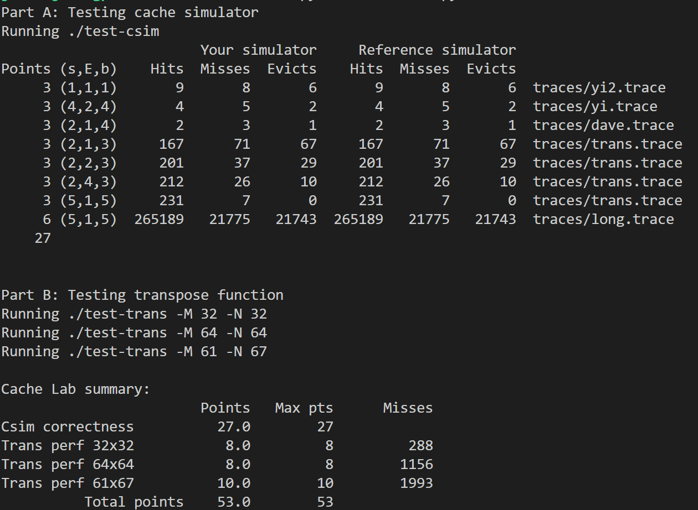

# Cachelab 思路

## PART A
该程序可以模拟高速缓存，读取`valgrind`的`lackey`工具的输出，模拟内存的`load`，`store`和`modify`等操作，复现其缓存命中/不命中等事件。

### 数据结构解释
**MemoryOperation**
``` c
typedef struct MEMORY_OPERATION
{
    OpCode code;
    unsigned long long address;
} MemoryOperation;
```
该结构描述了trace文件中的一个条目，如` S 7fefe05a8,8`，code是该条目指定的操作，address是该条目指定操作的目的地址。
枚举OpCode定义如下：
**OpCode**
``` c
typedef enum OP_CODE
{
    LOAD,      // Read memory
    STORE,     // Write memory
    MODIFY,    // Read and write
    DEPRECATED // If the entry was an instrument load, ignore it.
} OpCode;
```
`MODIFY`相当于进行了一次`LOAD`以及一次`STORE`,`DEPRECATED`表示当前处理的是一次指令存储，Writeup中要求忽略此操作。因此我们将其标记为"Deprecated"在后续处理中将其忽略。
**CacheEntry**
```c
typedef struct CACHE_ENTRY
{
    int validBit;
    int flag;
} CacheEntry;
```
该结构体定义了一个Cache行，由于我们不关心Cache的具体存储内容，因此我们只需要定义Cache行的有效位和标记位。

### 全局变量解释
```c
// setIndexBits: Number of set index bits. (S = 2^s is the number of sets)
// associaivity: Number of lines per set.
// blockBits:    Number of block offset bits.
// traceFile:    Valgrind trace to replay.
int setIndexBits = 0, blockBits = 0, associativity = 0;
FILE *traceFile;
```
这四个变量分别对应着命令行参数中的`-s` `-b` `-E` `-t`四个选项。
```c
// Denote whether the option '-v' is used
// If the option '-v' is used, enableVerbose will be 1
int enableVerbose = 0;
```
定义是否启用详细打印，默认关
```c
// Simulate cache table
CacheEntry **cache;

// Record the last used time
unsigned long long **timeTable;
unsigned long long cnt = 0;
```
模拟cache的主体，`timeTable`用于**LRU算法**。
```c
// Cache event counter
int missCount = 0, hitCount = 0, evictionCount = 0;
```
统计cache事件的计数器

### 函数逻辑解释
```c
int main(int argc, char **argv)
{
    if (readOptions(argc, argv))
        return 0;
    char *buffer = (char *)malloc(BUFFER_SIZE * sizeof(char));
    initCache();
    while (!feof(traceFile) && fgets(buffer, BUFFER_SIZE, traceFile))
    {
        MemoryOperation operation = readValgrindEntry(buffer);
        unsigned long long tag = operation.address &
                                 range(sizeof(unsigned long long) * 8, setIndexBits + blockBits);
        tag >>= setIndexBits + blockBits;
        unsigned long long setIndex = operation.address &
                                      range(setIndexBits + blockBits, blockBits);
        setIndex >>= blockBits;
        switch (operation.code)
        {
        case MODIFY:
            accessCache(tag, setIndex);
            // Fall through
        case LOAD:
        case STORE:
            accessCache(tag, setIndex);
            if (enableVerbose)
            {
                printf("\n");
            }
            break;
        case DEPRECATED:
            continue;
        }
    }
    printSummary(hitCount, missCount, evictionCount);
    free(buffer);
    deleteCache();
    fclose(traceFile);
    return 0;
}
```
首先我们使用**readOptions**函数读取命令行参数，**readOptions**定义如下：
``` c
int readOptions(int argc, char **argv)
{
    // Import some global variables to process the command line argument.
    extern char *optarg;
    extern int optind;
    int opt;
    while ((opt = getopt(argc, argv, "hvs:E:b:t:")) != -1)
    {
        switch (opt)
        {
        case 'v':
            enableVerbose = 1;
            break;
        case 's':
            setIndexBits = atoi(optarg);
            break;
        case 'E':
            associativity = atoi(optarg);
            break;
        case 'b':
            blockBits = atoi(optarg);
            break;
        case 't':
            traceFile = fopen(argv[optind - 1], "r");
            break;
        case 'h':
        case '?':
            // The first string in the array argv is the name of the program
            printHelpMsg(argv[0]);
            return 1;
        }
    }
    return 0;
}
```
该函数使用[**getopt**](https://manpages.debian.org/bookworm/manpages-dev/getopt.3.en.html)来读取命令行参数，注意到当用户提供了`-h`参数或其他错误的参数时，打印使用帮助并返回1，当**main**函数收到返回值为1时，直接返回。
随后我们初始化cache以及读取trace文件的缓冲区`buffer`。在while循环中我们每次读取一个trace文件行，将其传入**readValgrindEntry**中转换为一个``MemoryOperation``。对得到的结果，我们读取其地址，取出其对应的标记值和组索引值（`tag`和`setIndex`）。
之后，对于不同的操作，我们采取不同的操作：
* `MODIFY`: 访问两次
* `STORE` `LOAD`: 访问一次
* `DEPRECATED`: 忽略

**accessCache**是该程序的核心内容：
```c
void accessCache(unsigned long long tag, unsigned long long setIndex)
{
    int leastRecentUseTime = cnt;
    int leastRecentUseIndex = 0;
    CacheEntry *group = cache[setIndex];
    unsigned long long *table = timeTable[setIndex];
    int totalLine = associativity;
    for (int i = 0; i < totalLine; ++i)
    {
        if (group[i].validBit)
        {
            if (table[i] < leastRecentUseTime)
            {
                leastRecentUseIndex = i;
                leastRecentUseTime = table[i];
            }
            // Check whether target was in
            if (group[i].flag == tag)
            {
                if (enableVerbose)
                {
                    printf(" hit");
                }
                table[i] = ++cnt;
                ++hitCount;
                return;
            }
        }
        // If the valid bit of one line is 0, then all of its successor will have a 0 valid bit
        else
        {
            leastRecentUseIndex = i;
            break;
        }
    }
    if (enableVerbose)
    {
        printf(" miss");
    }
    ++missCount;
    if (group[leastRecentUseIndex].validBit)
    {
        if (enableVerbose)
        {
            printf(" eviction");
        }
        group[leastRecentUseIndex].flag = tag;
        table[leastRecentUseIndex] = ++cnt;
        ++evictionCount;
    }
    else
    {
        group[leastRecentUseIndex].flag = tag;
        group[leastRecentUseIndex].validBit = 1;
        table[leastRecentUseIndex] = ++cnt;
    }
}
```
该函数首先根据`setIndex`选出对应的组，然后遍历整个组，同时记录各个cache项的时间戳，如果找到了对应的cache项，则命中，否则不命中，进行后面的处理来判定是否需要驱逐。
最后我们打印结果。
附结果截图


## PART B

该部分要求我们优化一个矩阵转置的函数，使得cache的miss次数尽可能的低，其中cache的规格为32个组，每组一个cache block，每个cache block的大小为32 bytes。要求如下：

* $32\times32 : miss \lt 300$
* $64\times64 : miss \lt 1300$
* $61\times67 : miss \lt 2000$

## $32\times32$
我们首先分析一下cache和内存的对应关系，一个`int`类型的大小为4 bytes，而一个cache line可以存储32 bytes的数据，因此一个cache line最多可以存储8个`int`元素。即，cache line与内存的对应关系大致如下：

|   |0-7|8-15|16-23|24-31|
|---|:---:|:---:|:---:|:---:
|0|0|1|2|3|
|1|4|5|6|7|
|...|...|...|...|...|
|7|28|29|30|31|
|...|...|...|...|...|

行和列分别表示行索引和列索引，由于刚好有32个cache line，因此我们可以将矩阵切分为$8\times8$的小块，这样就能保证同一个分块全部位于cache中，降低miss次数。

同时根据writeup中的提示，我们可以创建至多12个局部变量，这些变量存于寄存器中，不会造成cache miss，利用这些局部变量，我们可以将cache line中的数据一次性全部读入，避免A矩阵和B矩阵之间反复load和store造成的大量miss。
``` c
#define BLOCK_SIZE_1 8
tmp0 = A[i * BLOCK_SIZ1+i_offset][j * BLOCK_SIZE_1];
tmp1 = A[i * BLOCK_SIZ1+i_offset][j * BLOCK_SIZE_1 + 1];
tmp2 = A[i * BLOCK_SIZ1+i_offset][j * BLOCK_SIZE_1 + 2];
tmp3 = A[i * BLOCK_SIZ1+i_offset][j * BLOCK_SIZE_1 + 3];
tmp4 = A[i * BLOCK_SIZ1+i_offset][j * BLOCK_SIZE_1 + 4];
tmp5 = A[i * BLOCK_SIZ1+i_offset][j * BLOCK_SIZE_1 + 5];
tmp6 = A[i * BLOCK_SIZ1+i_offset][j * BLOCK_SIZE_1 + 6];
tmp7 = A[i * BLOCK_SIZ1+i_offset][j * BLOCK_SIZE_1 + 7];
```
这样，以临时变量作为中转站，很大程度上减少了由于读取A而造成的cache miss。
全部代码如下：
``` c
#define BLOCK_SIZE_1 8
if (M == 32 && N == 32)
{
    for (i = 0; i < N / BLOCK_SIZE_1; ++i)
    {
        for (j = 0; j < M / BLOCK_SIZE_1; ++j)
        {
            for (i_offset = 0; i_offset < BLOCK_SIZE_1; ++i_offset)
            {
                tmp0 = A[i * BLOCK_SIZE_1 + i_offset][j * BLOCK_SIZE_1];
                tmp1 = A[i * BLOCK_SIZE_1 + i_offset][j * BLOCK_SIZE_1 + 1];
                tmp2 = A[i * BLOCK_SIZE_1 + i_offset][j * BLOCK_SIZE_1 + 2];
                tmp3 = A[i * BLOCK_SIZE_1 + i_offset][j * BLOCK_SIZE_1 + 3];
                tmp4 = A[i * BLOCK_SIZE_1 + i_offset][j * BLOCK_SIZE_1 + 4];
                tmp5 = A[i * BLOCK_SIZE_1 + i_offset][j * BLOCK_SIZE_1 + 5];
                tmp6 = A[i * BLOCK_SIZE_1 + i_offset][j * BLOCK_SIZE_1 + 6];
                tmp7 = A[i * BLOCK_SIZE_1 + i_offset][j * BLOCK_SIZE_1 + 7];
                B[j * BLOCK_SIZE_1][i * BLOCK_SIZE_1 + i_offset] = tmp0;
                B[j * BLOCK_SIZE_1 + 1][i * BLOCK_SIZE_1 + i_offset] = tmp1;
                B[j * BLOCK_SIZE_1 + 2][i * BLOCK_SIZE_1 + i_offset] = tmp2;
                B[j * BLOCK_SIZE_1 + 3][i * BLOCK_SIZE_1 + i_offset] = tmp3;
                B[j * BLOCK_SIZE_1 + 4][i * BLOCK_SIZE_1 + i_offset] = tmp4;
                B[j * BLOCK_SIZE_1 + 5][i * BLOCK_SIZE_1 + i_offset] = tmp5;
                B[j * BLOCK_SIZE_1 + 6][i * BLOCK_SIZE_1 + i_offset] = tmp6;
                B[j * BLOCK_SIZE_1 + 7][i * BLOCK_SIZE_1 + i_offset] = tmp7;
            }
        }
    }
}
```
最终得出的miss数量为288次，其中理论最优miss数量为$4\times4\times16+3=259$其中+3为传参导致的固定开销，比259部分多出来的部分主要是由于读取A的行和将要写入B的行恰好映射到同一个cacheline导致的。

## $64\times64$
类似于上一种情况，我们可以将该矩阵分块，但是注意到cache于内存的对应关系已经变为：

|   |0-7|8-15|16-23|24-31|...|
|---|:---:|:---:|:---:|:---:|:---:|
|0|0|1|2|3|...|
|1|8|9|10|11|...|
|...|...|...|...|...|...|
|4|0|1|2|3|...|
|...|...|...|...|...|...|

也就是说，如果我们像之前一样进行8*8的分块的话，在读取到第五行时就会发生cache的冲突，这样就会导致cache的miss次数升高。因此我们尝试使用$4\times4$的分块。然而这样又导致每一个cache line最后的4个元素没有被利用到，导致cache的利用率下降，使得miss次数较高（经测试为1700次左右），因此我们仍然使用$8\times8$的分块，再将其分为4个部分，在复制时进行一些特殊的操作来降低miss次数。

要使总的miss次数下降至1300以下，我们需要使平均每个分块的miss数下降至$1300\div64\approx20$次，我们可以采取如下操作：

$$
A_{i,j}=
\left(
\begin{matrix}
A_{11}&A_{12} \\
A_{21}&A_{22} 
\end{matrix}
\right)
$$
$$
B_{j,i}=
\left(
\begin{matrix}
B_{11}&B_{12} \\
B_{21}&B_{22}
\end{matrix}
\right)
$$

首先，我们将矩阵$A_{i,j},B_{j,i}$分成4个$4\times4$的块，先将$A_{11},A_{12}$分别复制到$B_{11},B_{12}$矩阵，这样会造成8次miss，然后我们在B上原址转置$B_{11},B_{12}$矩阵，这样B矩阵变为：

$$
B_{j,i}=
\left(
\begin{matrix}
A_{11}^T&A_{12}^T \\
B_{21}&B_{22}
\end{matrix}
\right)
$$

由于：
$$
A_{i,j}^T=
\left(
\begin{matrix}
A_{11}^T&A_{21}^T \\
A_{12}^T&A_{22}^T 
\end{matrix}
\right)
$$

因此我们还需要将$A_{12}^T$移动到$B_{21}$的位置，我们将进行如下操作：首先将$A_{21}$按列复制到`tmp0~tmp3`，将$A_{12}^T$对应的行复制到`tmp4~tmp7`，将`tmp4~tmp7`复制到$B_{21}$的对应位置，`tmp0~tmp3`复制到$A_{12}^T$的对应位置。在对角线($i=j$)的情形下，将会造成$7+3+3+3=16$次不命中，而在一般情形下，只会造成$4+1+1+1+1=8$次不命中，最后对于$B_{22}$使用常规方法转置，在对角线情况下产生$4+4=8$次不命中，而在一般情况下，由于$A_{22}$和$B_{22}$都已经存在于cache中，因而不会产生不命中，综合下来的总不命中次数测试为$1156$。

代码如下：
```c
else if (M == 64 && N == 64)
{
    for (i = 0; i < N / BLOCK_SIZE_1; ++i)
    {
        for (j = 0; j < M / BLOCK_SIZE_1; ++j)
        {
            for (i_offset = 0; i_offset < 4; ++i_offset)
            {
                tmp0 = A[i * BLOCK_SIZE_1 + i_offset][j * BLOCK_SIZE_1];
                tmp1 = A[i * BLOCK_SIZE_1 + i_offset][j * BLOCK_SIZE_1 + 1];
                tmp2 = A[i * BLOCK_SIZE_1 + i_offset][j * BLOCK_SIZE_1 + 2];
                tmp3 = A[i * BLOCK_SIZE_1 + i_offset][j * BLOCK_SIZE_1 + 3];
                tmp4 = A[i * BLOCK_SIZE_1 + i_offset][j * BLOCK_SIZE_1 + 4];
                tmp5 = A[i * BLOCK_SIZE_1 + i_offset][j * BLOCK_SIZE_1 + 5];
                tmp6 = A[i * BLOCK_SIZE_1 + i_offset][j * BLOCK_SIZE_1 + 6];
                tmp7 = A[i * BLOCK_SIZE_1 + i_offset][j * BLOCK_SIZE_1 + 7];
                // pre store
                B[j * BLOCK_SIZE_1 + i_offset][i * BLOCK_SIZE_1] = tmp0;
                B[j * BLOCK_SIZE_1 + i_offset][i * BLOCK_SIZE_1 + 1] = tmp1;
                B[j * BLOCK_SIZE_1 + i_offset][i * BLOCK_SIZE_1 + 2] = tmp2;
                B[j * BLOCK_SIZE_1 + i_offset][i * BLOCK_SIZE_1 + 3] = tmp3;
                B[j * BLOCK_SIZE_1 + i_offset][i * BLOCK_SIZE_1 + 4] = tmp4;
                B[j * BLOCK_SIZE_1 + i_offset][i * BLOCK_SIZE_1 + 5] = tmp5;
                B[j * BLOCK_SIZE_1 + i_offset][i * BLOCK_SIZE_1 + 6] = tmp6;
                B[j * BLOCK_SIZE_1 + i_offset][i * BLOCK_SIZE_1 + 7] = tmp7;
            }
            // Transform
            tmp0 = B[j * BLOCK_SIZE_1][i * BLOCK_SIZE_1 + 1];
            tmp1 = B[j * BLOCK_SIZE_1][i * BLOCK_SIZE_1 + 2];
            tmp2 = B[j * BLOCK_SIZE_1][i * BLOCK_SIZE_1 + 3];
            tmp3 = B[j * BLOCK_SIZE_1 + 1][i * BLOCK_SIZE_1 + 2];
            tmp4 = B[j * BLOCK_SIZE_1 + 1][i * BLOCK_SIZE_1 + 3];
            tmp5 = B[j * BLOCK_SIZE_1 + 2][i * BLOCK_SIZE_1 + 3];
            B[j * BLOCK_SIZE_1][i * BLOCK_SIZE_1 + 1] = B[j * BLOCK_SIZE_1 + 1][i * BLOCK_SIZE_1];
            B[j * BLOCK_SIZE_1][i * BLOCK_SIZE_1 + 2] = B[j * BLOCK_SIZE_1 + 2][i * BLOCK_SIZE_1];
            B[j * BLOCK_SIZE_1][i * BLOCK_SIZE_1 + 3] = B[j * BLOCK_SIZE_1 + 3][i * BLOCK_SIZE_1];
            B[j * BLOCK_SIZE_1 + 1][i * BLOCK_SIZE_1 + 2] = B[j * BLOCK_SIZE_1 + 2][i * BLOCK_SIZE_1 + 1];
            B[j * BLOCK_SIZE_1 + 1][i * BLOCK_SIZE_1 + 3] = B[j * BLOCK_SIZE_1 + 3][i * BLOCK_SIZE_1 + 1];
            B[j * BLOCK_SIZE_1 + 2][i * BLOCK_SIZE_1 + 3] = B[j * BLOCK_SIZE_1 + 3][i * BLOCK_SIZE_1 + 2];
            B[j * BLOCK_SIZE_1 + 1][i * BLOCK_SIZE_1] = tmp0;
            B[j * BLOCK_SIZE_1 + 2][i * BLOCK_SIZE_1] = tmp1;
            B[j * BLOCK_SIZE_1 + 3][i * BLOCK_SIZE_1] = tmp2;
            B[j * BLOCK_SIZE_1 + 2][i * BLOCK_SIZE_1 + 1] = tmp3;
            B[j * BLOCK_SIZE_1 + 3][i * BLOCK_SIZE_1 + 1] = tmp4;
            B[j * BLOCK_SIZE_1 + 3][i * BLOCK_SIZE_1 + 2] = tmp5;
            tmp0 = B[j * BLOCK_SIZE_1][i * BLOCK_SIZE_1 + 5];
            tmp1 = B[j * BLOCK_SIZE_1][i * BLOCK_SIZE_1 + 6];
            tmp2 = B[j * BLOCK_SIZE_1][i * BLOCK_SIZE_1 + 7];
            tmp3 = B[j * BLOCK_SIZE_1 + 1][i * BLOCK_SIZE_1 + 6];
            tmp4 = B[j * BLOCK_SIZE_1 + 1][i * BLOCK_SIZE_1 + 7];
            tmp5 = B[j * BLOCK_SIZE_1 + 2][i * BLOCK_SIZE_1 + 7];
            B[j * BLOCK_SIZE_1][i * BLOCK_SIZE_1 + 5] = B[j * BLOCK_SIZE_1 + 1][i * BLOCK_SIZE_1 + 4];
            B[j * BLOCK_SIZE_1][i * BLOCK_SIZE_1 + 6] = B[j * BLOCK_SIZE_1 + 2][i * BLOCK_SIZE_1 + 4];
            B[j * BLOCK_SIZE_1][i * BLOCK_SIZE_1 + 7] = B[j * BLOCK_SIZE_1 + 3][i * BLOCK_SIZE_1 + 4];
            B[j * BLOCK_SIZE_1 + 1][i * BLOCK_SIZE_1 + 6] = B[j * BLOCK_SIZE_1 + 2][i * BLOCK_SIZE_1 + 5];
            B[j * BLOCK_SIZE_1 + 1][i * BLOCK_SIZE_1 + 7] = B[j * BLOCK_SIZE_1 + 3][i * BLOCK_SIZE_1 + 5];
            B[j * BLOCK_SIZE_1 + 2][i * BLOCK_SIZE_1 + 7] = B[j * BLOCK_SIZE_1 + 3][i * BLOCK_SIZE_1 + 6];
            B[j * BLOCK_SIZE_1 + 1][i * BLOCK_SIZE_1 + 4] = tmp0;
            B[j * BLOCK_SIZE_1 + 2][i * BLOCK_SIZE_1 + 4] = tmp1;
            B[j * BLOCK_SIZE_1 + 3][i * BLOCK_SIZE_1 + 4] = tmp2;
            B[j * BLOCK_SIZE_1 + 2][i * BLOCK_SIZE_1 + 5] = tmp3;
            B[j * BLOCK_SIZE_1 + 3][i * BLOCK_SIZE_1 + 5] = tmp4;
            B[j * BLOCK_SIZE_1 + 3][i * BLOCK_SIZE_1 + 6] = tmp5;
            for (i_offset = 0; i_offset < 4; ++i_offset)
            {
                tmp0 = A[i * BLOCK_SIZE_1 + 4][j * BLOCK_SIZE_1 + i_offset];
                tmp1 = A[i * BLOCK_SIZE_1 + 5][j * BLOCK_SIZE_1 + i_offset];
                tmp2 = A[i * BLOCK_SIZE_1 + 6][j * BLOCK_SIZE_1 + i_offset];
                tmp3 = A[i * BLOCK_SIZE_1 + 7][j * BLOCK_SIZE_1 + i_offset];
                tmp4 = B[j * BLOCK_SIZE_1 + i_offset][i * BLOCK_SIZE_1 + 4];
                tmp5 = B[j * BLOCK_SIZE_1 + i_offset][i * BLOCK_SIZE_1 + 5];
                tmp6 = B[j * BLOCK_SIZE_1 + i_offset][i * BLOCK_SIZE_1 + 6];
                tmp7 = B[j * BLOCK_SIZE_1 + i_offset][i * BLOCK_SIZE_1 + 7];
                B[j * BLOCK_SIZE_1 + i_offset][i * BLOCK_SIZE_1 + 4] = tmp0;
                B[j * BLOCK_SIZE_1 + i_offset][i * BLOCK_SIZE_1 + 5] = tmp1;
                B[j * BLOCK_SIZE_1 + i_offset][i * BLOCK_SIZE_1 + 6] = tmp2;
                B[j * BLOCK_SIZE_1 + i_offset][i * BLOCK_SIZE_1 + 7] = tmp3;
                B[j * BLOCK_SIZE_1 + i_offset + 4][i * BLOCK_SIZE_1] = tmp4;
                B[j * BLOCK_SIZE_1 + i_offset + 4][i * BLOCK_SIZE_1 + 1] = tmp5;
                B[j * BLOCK_SIZE_1 + i_offset + 4][i * BLOCK_SIZE_1 + 2] = tmp6;
                B[j * BLOCK_SIZE_1 + i_offset + 4][i * BLOCK_SIZE_1 + 3] = tmp7;
            }
            for (; i_offset < BLOCK_SIZE_1; ++i_offset)
            {
                tmp0 = A[i * BLOCK_SIZE_1 + i_offset][j * BLOCK_SIZE_1 + 4];
                tmp1 = A[i * BLOCK_SIZE_1 + i_offset][j * BLOCK_SIZE_1 + 5];
                tmp2 = A[i * BLOCK_SIZE_1 + i_offset][j * BLOCK_SIZE_1 + 6];
                tmp3 = A[i * BLOCK_SIZE_1 + i_offset][j * BLOCK_SIZE_1 + 7];
                B[j * BLOCK_SIZE_1 + 4][i * BLOCK_SIZE_1 + i_offset] = tmp0;
                B[j * BLOCK_SIZE_1 + 5][i * BLOCK_SIZE_1 + i_offset] = tmp1;
                B[j * BLOCK_SIZE_1 + 6][i * BLOCK_SIZE_1 + i_offset] = tmp2;
                B[j * BLOCK_SIZE_1 + 7][i * BLOCK_SIZE_1 + i_offset] = tmp3;
            }
        }
    }
}
```

## $61\times67$
由于该大小的矩阵无法与cacheline建立简明的对应关系，因此我们通过测试不同的分块大小，测试出哪一种分块可以满足题目的要求，经测试$16\times16$的分块可以满足题目的要求。

代码如下：
```c
else // if(M==61&&N==67)
{
    // Process 64 x 48
    for (i = 0; i < N / BLOCK_SIZE_2 + 1; ++i)
    {
        for (j = 0; j < M / BLOCK_SIZE_2 + 1; ++j)
        {
            for (i_offset = 0; i_offset < BLOCK_SIZE_2 && i_offset + BLOCK_SIZE_2 * i < N; ++i_offset)
            {
                for (tmp0 = 0; tmp0 < BLOCK_SIZE_2 && tmp0 + BLOCK_SIZE_2 * j < M; ++tmp0)
                {
                    B[BLOCK_SIZE_2 * j + tmp0][BLOCK_SIZE_2 * i + i_offset] = A[BLOCK_SIZE_2 * i + i_offset][BLOCK_SIZE_2 * j + tmp0];
                }
            }
        }
    }
}
```

结果如图：

