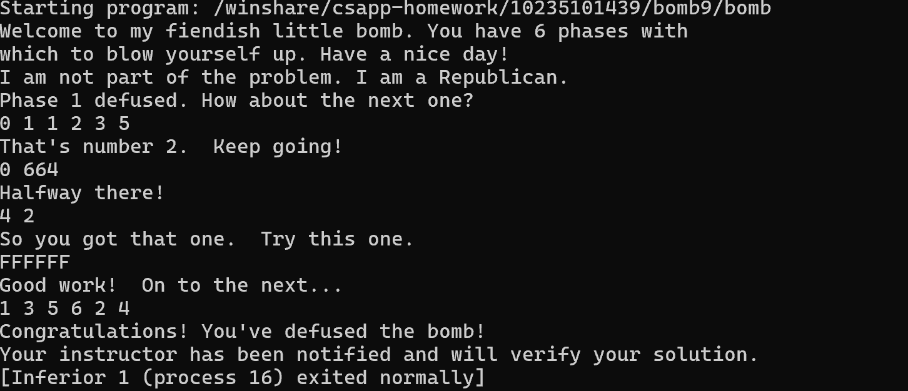

# Bomb Lab思路

## Phase 1
#### 答案：I am not part of the problem. I am a Republican.
反汇编代码如下：
``` asm
0000000000001204 <phase_1>:
    1204:	48 83 ec 08          	sub    $0x8,%rsp
    1208:	48 8d 35 81 17 00 00 	lea    0x1781(%rip),%rsi        # 2990 <_IO_stdin_used+0x150>
    120f:	e8 85 04 00 00       	callq  1699 <strings_not_equal>
    1214:	85 c0                	test   %eax,%eax
    1216:	75 05                	jne    121d <phase_1+0x19>
    1218:	48 83 c4 08          	add    $0x8,%rsp
    121c:	c3                   	retq   
    121d:	e8 32 07 00 00       	callq  1954 <explode_bomb>
    1222:	eb f4                	jmp    1218 <phase_1+0x14>
```
如上面的语句块所示，该函数首先将目标字符串的地址存入rsi中（即`0x120f+0x1781=0x2990`），并通过`strings_not_equal`比较（由此可知需要输入的是字符串）随后我们通过hexdump读取二进制信息
```
......
00002990  49 20 61 6d 20 6e 6f 74  20 70 61 72 74 20 6f 66  |I am not part of|
000029a0  20 74 68 65 20 70 72 6f  62 6c 65 6d 2e 20 49 20  | the problem. I |
000029b0  61 6d 20 61 20 52 65 70  75 62 6c 69 63 61 6e 2e  |am a Republican.|
......
```
由此可知字符串内容。

## Phase 2
#### 答案：0 1 1 2 3 5
开头的反汇编如下：
``` asm
......
    1233:	48 89 44 24 18       	mov    %rax,0x18(%rsp)
    1238:	31 c0                	xor    %eax,%eax
    123a:	48 89 e6             	mov    %rsp,%rsi
    123d:	e8 4e 07 00 00       	callq  1990 <read_six_numbers>
    1242:	83 3c 24 00          	cmpl   $0x0,(%rsp)
    1246:	75 07                	jne    124f <phase_2+0x2b>
    1248:	83 7c 24 04 01       	cmpl   $0x1,0x4(%rsp)
    124d:	74 05                	je     1254 <phase_2+0x30>
    124f:	e8 00 07 00 00       	callq  1954 <explode_bomb>
......
```
这一段提示我们phase 2的内容为六个数字，随后该函数对rsp和rbp等寄存器进行了适当的设置（代码省略），以进行下面这个循环：
``` asm
......
    125d:	48 83 c3 04          	add    $0x4,%rbx
    1261:	48 39 eb             	cmp    %rbp,%rbx
    1264:	74 11                	je     1277 <phase_2+0x53>
    1266:	8b 43 04             	mov    0x4(%rbx),%eax
    1269:	03 03                	add    (%rbx),%eax
    126b:	39 43 08             	cmp    %eax,0x8(%rbx)
    126e:	74 ed                	je     125d <phase_2+0x39>
    1270:	e8 df 06 00 00       	callq  1954 <explode_bomb>
    1275:	eb e6                	jmp    125d <phase_2+0x39>
......
```
我们假定读入的6个数字存入一个名为arr的数组之中，那么1266~1270的代码段就相当于对所有元素判断其是否为前两个数字之和（即斐波那契数列），并由
```
......
    1242:	83 3c 24 00          	cmpl   $0x0,(%rsp)
    1246:	75 07                	jne    124f <phase_2+0x2b>
    1248:	83 7c 24 04 01       	cmpl   $0x1,0x4(%rsp)
......
```
可知，`arr[0]==0`且`arr[1]==1`。

## Phase 3
#### 答案：0 664（答案不唯一）
由开头的
``` asm
......
    12a0:	48 89 44 24 08       	mov    %rax,0x8(%rsp)
    12a5:	31 c0                	xor    %eax,%eax
    12a7:	48 8d 4c 24 04       	lea    0x4(%rsp),%rcx
    12ac:	48 89 e2             	mov    %rsp,%rdx
    12af:	48 8d 35 bf 19 00 00 	lea    0x19bf(%rip),%rsi        # 2c75 <array.3417+0x255>
    12b6:	e8 25 fc ff ff       	callq  ee0 <__isoc99_sscanf@plt>
......
```
结合`0x12b6+0x19bf=0x2c75`处的字符串`"%d %d"`知，该题需要读入两个数字
由后面的间接跳转语句知，此处为一段类似switch语句的代码
``` asm
......
    12c6:	8b 04 24             	mov    (%rsp),%eax
    12c9:	48 8d 15 30 17 00 00 	lea    0x1730(%rip),%rdx        # 2a00 <_IO_stdin_used+0x1c0>
    12d0:	48 63 04 82          	movslq (%rdx,%rax,4),%rax
    12d4:	48 01 d0             	add    %rdx,%rax
    12d7:	ff e0                	jmpq   *%rax
......
```
rdx中存储了跳表的基址，rax存储了跳表的条目编号（以4bytes为一个条目），我们查看对应位置的二进制
```
......
00002a00  1d e9 ff ff e0 e8 ff ff  e7 e8 ff ff ee e8 ff ff  |................|
00002a10  f5 e8 ff ff fc e8 ff ff  03 e9 ff ff 0a e9 ff ff  |................|
......
```
容易看出此处存储的是相对位置，我们以`%rax=0`的情况为例，当`%rax==0`时，我们找到对应的条目为`1d e9 ff ff`，转换成补码后为`-0x16e3`，则跳转的目标地址为`0x2a00-0x16e3=0x131d`，再根据汇编代码
``` asm
......
    12de:	eb e0                	jmp    12c0 <phase_3+0x2d>
    12e0:	b8 5b 00 00 00       	mov    $0x5b,%eax
    12e5:	eb 3b                	jmp    1322 <phase_3+0x8f>
    12e7:	b8 9b 01 00 00       	mov    $0x19b,%eax
    12ec:	eb 34                	jmp    1322 <phase_3+0x8f>
    12ee:	b8 d3 02 00 00       	mov    $0x2d3,%eax
    12f3:	eb 2d                	jmp    1322 <phase_3+0x8f>
    12f5:	b8 a1 02 00 00       	mov    $0x2a1,%eax
    12fa:	eb 26                	jmp    1322 <phase_3+0x8f>
    12fc:	b8 da 02 00 00       	mov    $0x2da,%eax
    1301:	eb 1f                	jmp    1322 <phase_3+0x8f>
    1303:	b8 d4 00 00 00       	mov    $0xd4,%eax
    1308:	eb 18                	jmp    1322 <phase_3+0x8f>
    130a:	b8 d0 02 00 00       	mov    $0x2d0,%eax
    130f:	eb 11                	jmp    1322 <phase_3+0x8f>
    1311:	e8 3e 06 00 00       	callq  1954 <explode_bomb>
    1316:	b8 00 00 00 00       	mov    $0x0,%eax
    131b:	eb 05                	jmp    1322 <phase_3+0x8f>
    131d:	b8 98 02 00 00       	mov    $0x298,%eax
    1322:	39 44 24 04          	cmp    %eax,0x4(%rsp)
    1326:	74 05                	je     132d <phase_3+0x9a>
    1328:	e8 27 06 00 00       	callq  1954 <explode_bomb>
    132d:	48 8b 44 24 08       	mov    0x8(%rsp),%rax
    1332:	64 48 33 04 25 28 00 	xor    %fs:0x28,%rax
......
```
可知此处需要让第二个输入为`0x298=664`，所以一个可行的输入为0 664

## Phase 4
#### 答案：4 2 DrEvil（答案不唯一）
该phase的开头同phase3，由此可知，我们需要输入两个数字。随后，下列指令：
``` asm
......
    13be:	ba 0e 00 00 00       	mov    $0xe,%edx
    13c3:	be 00 00 00 00       	mov    $0x0,%esi
    13c8:	8b 3c 24             	mov    (%rsp),%edi
    13cb:	e8 77 ff ff ff       	callq  1347 <func4>
......
```
调用了函数func4,即`func4(input1,0,14)`。
根据func4的反汇编结果，我们可以将func4写成如下的Python代码
``` python
def func4(edi,esi,edx):
    eax=edx-esi
    ecx=eax
    if  ecx>=0:
        ecx=0
    else:
        ecx=1
    #以上条件分支是根据shr $0x1f,%ecx的结果改写的，而非直接转译
    ecx+=eax
    ecx>>=1 #sar %ecx
    ecx+=esi
    if ecx>edi:
        edx=ecx-1
        eax=func4(edi,esi,edx)
        return 2*eax
    else:
        eax=0
        if ecx<edi:
            esi=ecx+1
            eax=func4(edi,esi,edx)
            return 2*eax+1
        return eax
```
我们使用这样的一个python程序暴力测试每一种情况，可知`5 2`也是满足条件的答案：
``` python
for i in range(0,15):
    if func4(i,0,14)==2:
        print(i)
```
由`secret_phase`部分的分析可知，我们需要在此处再添加一个`DrEvil`以解决`secret_phase`

## Phase 5
#### 答案：FFFFFF（答案不唯一）
函数开头调用了`string_length`，由下面的判断可知我们需要输入一个6字符的单词
``` asm
......
    13ff:	e8 78 02 00 00       	callq  167c <string_length>
    1404:	83 f8 06             	cmp    $0x6,%eax
    1407:	75 31                	jne    143a <phase_5+0x3f>
......
    143a:	e8 15 05 00 00       	callq  1954 <explode_bomb>
......
```

下面的这段汇编代码遍历输入的六个字符
``` asm
......
    1409:	48 89 d8             	mov    %rbx,%rax
    140c:	48 8d 7b 06          	lea    0x6(%rbx),%rdi
    1410:	b9 00 00 00 00       	mov    $0x0,%ecx
    1415:	48 8d 35 04 16 00 00 	lea    0x1604(%rip),%rsi        # 2a20 <array.3417>
    141c:	0f b6 10             	movzbl (%rax),%edx
    141f:	83 e2 0f             	and    $0xf,%edx
    1422:	03 0c 96             	add    (%rsi,%rdx,4),%ecx
    1425:	48 83 c0 01          	add    $0x1,%rax
    1429:	48 39 f8             	cmp    %rdi,%rax
    142c:	75 ee                	jne    141c <phase_5+0x21>
......
```
`%rsi`指向位于`0x2a20`处的数组，对每个字符，取出他的低四位字节（或者说，对16取模），通过`%rsi+4*%rdx`计算对应的数值累加到`%ecx`上（这个过程类似于哈希函数）。根据`0x2a20`处的数据
```
00002a20  02 00 00 00 0a 00 00 00  06 00 00 00 01 00 00 00  |................|
00002a30  0c 00 00 00 10 00 00 00  09 00 00 00 03 00 00 00  |................|
00002a40  04 00 00 00 07 00 00 00  0e 00 00 00 05 00 00 00  |................|
00002a50  0b 00 00 00 08 00 00 00  0f 00 00 00 0d 00 00 00  |................|
```
我们可以构建出以下数组：
``` c
    int hash[16]={0x02,0x0a,0x06,0x01,0x0c,0x10,0x09,0x03,0x04,0x07,0x0e,0x05,0x0b,0x08,0x0f,0x0d};
```
由以下代码可知，我们的目标是找出这样的一个单词：使得所有字符对应的hash值和为`0x36`
``` asm
    142e:	83 f9 36             	cmp    $0x36,%ecx
    1431:	74 05                	je     1438 <phase_5+0x3d>
    1433:	e8 1c 05 00 00       	callq  1954 <explode_bomb>
```
注意到字母`F`的ascii码为`0x46`，而`0x46%0x0F==0x06`，对应的hash值为`0x09`，因此`FFFFFF`的哈希值之和为`0x36`。

## Phase 6
#### 答案：1 3 5 6 2 4
由下可知：答案为6个数字
``` asm
......
    1461:	e8 2a 05 00 00       	callq  1990 <read_six_numbers>
    1466:	41 bd 00 00 00 00    	mov    $0x0,%r13d
    146c:	eb 25                	jmp    1493 <phase_6+0x52>
......
```
随后的语句首先限制eax的范围在`1~6`之间，同时预示了一个六次的循环：
``` asm
......
    1493:	4c 89 e5             	mov    %r12,%rbp
    1496:	41 8b 04 24          	mov    (%r12),%eax
    149a:	83 e8 01             	sub    $0x1,%eax
    149d:	83 f8 05             	cmp    $0x5,%eax
    14a0:	77 cc                	ja     146e <phase_6+0x2d>
    14a2:	41 83 c5 01          	add    $0x1,%r13d
    14a6:	41 83 fd 06          	cmp    $0x6,%r13d
    14aa:	74 35                	je     14e1 <phase_6+0xa0>
......
```
下面的这段语句看起来似乎是为了确认六个数字没有重复
``` asm
......
    1475:	83 c3 01             	add    $0x1,%ebx
    1478:	83 fb 05             	cmp    $0x5,%ebx
    147b:	7f 12                	jg     148f <phase_6+0x4e>
    147d:	48 63 c3             	movslq %ebx,%rax
    1480:	8b 04 84             	mov    (%rsp,%rax,4),%eax
    1483:	39 45 00             	cmp    %eax,0x0(%rbp)
    1486:	75 ed                	jne    1475 <phase_6+0x34>
    1488:	e8 c7 04 00 00       	callq  1954 <explode_bomb>
    148d:	eb e6                	jmp    1475 <phase_6+0x34>
......
    14ac:	44 89 eb             	mov    %r13d,%ebx
    14af:	eb cc                	jmp    147d <phase_6+0x3c>
......
```
在确认没有重复后，下列的代码将被执行
``` asm
......
    148f:	49 83 c4 04          	add    $0x4,%r12
    1493:	4c 89 e5             	mov    %r12,%rbp
    1496:	41 8b 04 24          	mov    (%r12),%eax
    149a:	83 e8 01             	sub    $0x1,%eax
    149d:	83 f8 05             	cmp    $0x5,%eax
    14a0:	77 cc                	ja     146e <phase_6+0x2d>
    14a2:	41 83 c5 01          	add    $0x1,%r13d
    14a6:	41 83 fd 06          	cmp    $0x6,%r13d
    14aa:	74 35                	je     14e1 <phase_6+0xa0>
......
```
这就是前面所示的那段代码，也就是说，该循环的整体情况即是如此。通过r12的自增，eax取遍了6个输入，那么注意到之前我们提到

> eax的范围在`1~6`之间

那么6个输入刚刚好取遍`1~6`中的所有值。
在进行了上述的检查后，程序跳转至如下的位置
``` asm
......
    14b1:	48 8b 52 08          	mov    0x8(%rdx),%rdx
    14b5:	83 c0 01             	add    $0x1,%eax
    14b8:	39 c8                	cmp    %ecx,%eax
    14ba:	75 f5                	jne    14b1 <phase_6+0x70>
    14bc:	48 89 54 f4 20       	mov    %rdx,0x20(%rsp,%rsi,8)
    14c1:	48 83 c6 01          	add    $0x1,%rsi
    14c5:	48 83 fe 06          	cmp    $0x6,%rsi
    14c9:	74 1d                	je     14e8 <phase_6+0xa7>
    14cb:	8b 0c b4             	mov    (%rsp,%rsi,4),%ecx
    14ce:	b8 01 00 00 00       	mov    $0x1,%eax
    14d3:	48 8d 15 56 2d 20 00 	lea    0x202d56(%rip),%rdx        # 204230 <node1>
    14da:	83 f9 01             	cmp    $0x1,%ecx
    14dd:	7f d2                	jg     14b1 <phase_6+0x70>
    14df:	eb db                	jmp    14bc <phase_6+0x7b>
    14e1:	be 00 00 00 00       	mov    $0x0,%esi
    14e6:	eb e3                	jmp    14cb <phase_6+0x8a>
......
```
`0x14d3`处的`node1`以及`0x14b1`处的操作推测这里使用了类似链表的数据结构。`%ecx`中先后存入了六个输入，然后依次和链表中的数据进行比较。下面是用gdb从`node1`附近读取的节点信息：
``` plain
(gdb) x /20 0x555555604230
0x555555604230 <node1>: 0x00000325      0x00000001      0x55604240      0x00005555
0x555555604240 <node2>: 0x000000d0      0x00000002      0x55604250      0x00005555
0x555555604250 <node3>: 0x00000324      0x00000003      0x55604260      0x00005555
0x555555604260 <node4>: 0x000000c9      0x00000004      0x55604270      0x00005555
0x555555604270 <node5>: 0x00000263      0x00000005      0x55604110      0x00005555
```
从node5可以看出还有漏网之鱼，所以
``` plain
(gdb) x /4 0x555555604110
0x555555604110 <node6>: 0x0000017d      0x00000006      0x00000000      0x00000000
```
观察下列代码：
``` asm
    14b1:	48 8b 52 08          	mov    0x8(%rdx),%rdx
    14b5:	83 c0 01             	add    $0x1,%eax
    14b8:	39 c8                	cmp    %ecx,%eax
    14ba:	75 f5                	jne    14b1 <phase_6+0x70>
    14bc:	48 89 54 f4 20       	mov    %rdx,0x20(%rsp,%rsi,8)
    14c1:	48 83 c6 01          	add    $0x1,%rsi
    14c5:	48 83 fe 06          	cmp    $0x6,%rsi
    14c9:	74 1d                	je     14e8 <phase_6+0xa7>
    14cb:	8b 0c b4             	mov    (%rsp,%rsi,4),%ecx
    14ce:	b8 01 00 00 00       	mov    $0x1,%eax
    14d3:	48 8d 15 56 2d 20 00 	lea    0x202d56(%rip),%rdx        # 204230 <node1>
    14da:	83 f9 01             	cmp    $0x1,%ecx
    14dd:	7f d2                	jg     14b1 <phase_6+0x70>
```
通过上面gdb的信息，我们可以知道,`mov    0x8(%rdx),%rdx`和`mov    %rdx,0x20(%rsp,%rsi,8)`的目的是将各个node的地址存入栈中，由于六个输入占据了栈顶的空间，因此从`0x20`之后才开始存储这些地址。在完成上述操作后，程序跳转到：
``` asm
......
    14e8:	48 8b 5c 24 20       	mov    0x20(%rsp),%rbx
    14ed:	48 8b 44 24 28       	mov    0x28(%rsp),%rax
    14f2:	48 89 43 08          	mov    %rax,0x8(%rbx)
    14f6:	48 8b 54 24 30       	mov    0x30(%rsp),%rdx
    14fb:	48 89 50 08          	mov    %rdx,0x8(%rax)
    14ff:	48 8b 44 24 38       	mov    0x38(%rsp),%rax
    1504:	48 89 42 08          	mov    %rax,0x8(%rdx)
    1508:	48 8b 54 24 40       	mov    0x40(%rsp),%rdx
    150d:	48 89 50 08          	mov    %rdx,0x8(%rax)
    1511:	48 8b 44 24 48       	mov    0x48(%rsp),%rax
    1516:	48 89 42 08          	mov    %rax,0x8(%rdx)
    151a:	48 c7 40 08 00 00 00 	movq   $0x0,0x8(%rax)
......
```
这段代码重新排列了链表的顺序，让链表按照入栈的先后顺序排列，同时rax指向最后一个元素，在完成以上操作后，执行下面的一个循环：
``` asm
......
    1522:	bd 05 00 00 00       	mov    $0x5,%ebp
    1527:	eb 09                	jmp    1532 <phase_6+0xf1>
    1529:	48 8b 5b 08          	mov    0x8(%rbx),%rbx
    152d:	83 ed 01             	sub    $0x1,%ebp
    1530:	74 11                	je     1543 <phase_6+0x102>
    1532:	48 8b 43 08          	mov    0x8(%rbx),%rax
    1536:	8b 00                	mov    (%rax),%eax
    1538:	39 03                	cmp    %eax,(%rbx)
    153a:	7d ed                	jge    1529 <phase_6+0xe8>
    153c:	e8 13 04 00 00       	callq  1954 <explode_bomb>
    1541:	eb e6                	jmp    1529 <phase_6+0xe8>
......
```
由下面的jge等语句可知，我们的目标是将该链表中的元素值按照从大到小的顺序排列，大小顺序为`0x325>0x324>0x263>0x17d>0xd0>0xc9`，则顺序为$1\rightarrow3\rightarrow5\rightarrow6\rightarrow2\rightarrow4$

## Secret Phase
#### 答案：107
注意到反编译出的phase6函数下方还有一个被称为secret_phase的函数，查找相关的引用可知，在phase_defused函数中调用了secret_phase函数
``` asm
......
    1bb0:	48 8d 3d 69 0f 00 00 	lea    0xf69(%rip),%rdi        # 2b20 <array.3417+0x100>
    1bb7:	e8 64 f2 ff ff       	callq  e20 <puts@plt>
    1bbc:	48 8d 3d 85 0f 00 00 	lea    0xf85(%rip),%rdi        # 2b48 <array.3417+0x128>
    1bc3:	e8 58 f2 ff ff       	callq  e20 <puts@plt>
    1bc8:	b8 00 00 00 00       	mov    $0x0,%eax
    1bcd:	e8 d0 f9 ff ff       	callq  15a2 <secret_phase>
    1bd2:	eb ad                	jmp    1b81 <phase_defused+0x6c>
......
```
注意到该函数的开头有：
``` asm
......
    1b33:	83 3d 72 2b 20 00 06 	cmpl   $0x6,0x202b72(%rip)        # 2046ac <num_input_strings>
    1b3a:	74 19                	je     1b55 <phase_defused+0x40>
    1b3c:	48 8b 44 24 68       	mov    0x68(%rsp),%rax
    1b41:	64 48 33 04 25 28 00 	xor    %fs:0x28,%rax
    1b48:	00 00 
    1b4a:	0f 85 84 00 00 00    	jne    1bd4 <phase_defused+0xbf>
    1b50:	48 83 c4 78          	add    $0x78,%rsp
    1b54:	c3                   	retq   
......
```
由注释中`num_input_strings`可以推测这个全局变量记录了输入的字符串的个数（前六个phase均是由`read_line`以字符串形式读入并被`sscanf`解析的），因此第六个phase被解决后才会跳转到`secret_phase`的部分，根据此处的分析，我们只需要找到
``` asm
......
    1b6b:	48 8d 3d 3e 2c 20 00 	lea    0x202c3e(%rip),%rdi        # 2047b0 <input_strings+0xf0>
    1b72:	b8 00 00 00 00       	mov    $0x0,%eax
    1b77:	e8 64 f3 ff ff       	callq  ee0 <__isoc99_sscanf@plt>
......
```
这里被传入`rdi`的是哪个字符串的地址即可找到触发`secret_phase`的条件
我们在gdb中：
```
(gdb) disassemble 0x0000555555401b15
Dump of assembler code for function phase_defused:
   0x0000555555401b15 <+0>:     sub    $0x78,%rsp
   0x0000555555401b19 <+4>:     mov    %fs:0x28,%rax
   0x0000555555401b22 <+13>:    mov    %rax,0x68(%rsp)
   0x0000555555401b27 <+18>:    xor    %eax,%eax
   0x0000555555401b29 <+20>:    mov    $0x1,%edi
   0x0000555555401b2e <+25>:    callq  0x555555401830 <send_msg>
   0x0000555555401b33 <+30>:    cmpl   $0x6,0x202b72(%rip)        # 0x5555556046ac <num_input_strings>
   0x0000555555401b3a <+37>:    je     0x555555401b55 <phase_defused+64>
   0x0000555555401b3c <+39>:    mov    0x68(%rsp),%rax
   0x0000555555401b41 <+44>:    xor    %fs:0x28,%rax
   0x0000555555401b4a <+53>:    jne    0x555555401bd4 <phase_defused+191>
   0x0000555555401b50 <+59>:    add    $0x78,%rsp
   0x0000555555401b54 <+63>:    retq
   0x0000555555401b55 <+64>:    lea    0xc(%rsp),%rcx
   0x0000555555401b5a <+69>:    lea    0x8(%rsp),%rdx
   0x0000555555401b5f <+74>:    lea    0x10(%rsp),%r8
   0x0000555555401b64 <+79>:    lea    0x1154(%rip),%rsi        # 0x555555402cbf
   0x0000555555401b6b <+86>:    lea    0x202c3e(%rip),%rdi        # 0x5555556047b0 <input_strings+240>
   0x0000555555401b72 <+93>:    mov    $0x0,%eax
   0x0000555555401b77 <+98>:    callq  0x555555400ee0 <__isoc99_sscanf@plt>
   0x0000555555401b7c <+103>:   cmp    $0x3,%eax
   0x0000555555401b7f <+106>:   je     0x555555401b9b <phase_defused+134>
   0x0000555555401b81 <+108>:   lea    0xff8(%rip),%rdi        # 0x555555402b80
   0x0000555555401b88 <+115>:   callq  0x555555400e20 <puts@plt>
   0x0000555555401b8d <+120>:   lea    0x101c(%rip),%rdi        # 0x555555402bb0
   0x0000555555401b94 <+127>:   callq  0x555555400e20 <puts@plt>
   0x0000555555401b99 <+132>:   jmp    0x555555401b3c <phase_defused+39>
   0x0000555555401b9b <+134>:   lea    0x10(%rsp),%rdi
(gdb) x /16b 0x5555556047b0
0x5555556047b0 <input_strings+240>:     0x34    0x20    0x32    0x00    0x00    0x00    0x00    0x00
0x5555556047b8 <input_strings+248>:     0x00    0x00    0x00    0x00    0x00    0x00    0x00    0x00
```
可知，此处存储的字符串为`"4 2"`这是我们对phase4的解答，根据`rsi`指向的字符串内容
```
00002cb0  20 6c 69 6e 65 20 74 6f  6f 20 6c 6f 6e 67 00 25  | line too long.%|
00002cc0  64 20 25 64 20 25 73 00  44 72 45 76 69 6c 00 31  |d %d %s.DrEvil.1|
00002cd0  31 33 2e 33 31 2e 31 31  37 2e 31 38 33 00 00 00  |13.31.117.183...|
```
可知我们的第三个输入应该是一个字符串，由
``` asm
......
    1b99:	eb a1                	jmp    1b3c <phase_defused+0x27>
    1b9b:	48 8d 7c 24 10       	lea    0x10(%rsp),%rdi
    1ba0:	48 8d 35 21 11 00 00 	lea    0x1121(%rip),%rsi        # 2cc8 <array.3417+0x2a8>
    1ba7:	e8 ed fa ff ff       	callq  1699 <strings_not_equal>
    1bac:	85 c0                	test   %eax,%eax
    1bae:	75 d1                	jne    1b81 <phase_defused+0x6c>
......
```
我们知道这个输入的字符串需要与`rsi`指向的字符串相同，由上面的hexdump信息可知字符串为`"DrEvil"`，因此我们需要把phase4修改为`4 2 DrEvil`以进入`secret_phase`.
由`secret_phase`的开头代码
```
......
    15a2:	53                   	push   %rbx
    15a3:	e8 29 04 00 00       	callq  19d1 <read_line>
    15a8:	ba 0a 00 00 00       	mov    $0xa,%edx
    15ad:	be 00 00 00 00       	mov    $0x0,%esi
    15b2:	48 89 c7             	mov    %rax,%rdi
    15b5:	e8 06 f9 ff ff       	callq  ec0 <strtol@plt>
    15ba:	48 89 c3             	mov    %rax,%rbx
    15bd:	8d 40 ff             	lea    -0x1(%rax),%eax
    15c0:	3d e8 03 00 00       	cmp    $0x3e8,%eax
    15c5:	77 2b                	ja     15f2 <secret_phase+0x50>
......
```
可知此处要求我们输入一个在`0x0~0x3e8`范围内的十进制数字。随后将该数字作为参数传递给`fun7`
```
......
    15c9:	48 8d 3d 80 2b 20 00 	lea    0x202b80(%rip),%rdi        # 204150 <n1>
    15d0:	e8 8e ff ff ff       	callq  1563 <fun7>
    15d5:	83 f8 03             	cmp    $0x3,%eax
......
```
注意到此处还传递了一个`n1`，我们通过gdb读取其相关的值
```
(gdb) x /60 0x555555604150
0x555555604150 <n1>:    0x00000024      0x00000000      0x55604170      0x00005555
0x555555604160 <n1+16>: 0x55604190      0x00005555      0x00000000      0x00000000
0x555555604170 <n21>:   0x00000008      0x00000000      0x556041f0      0x00005555
0x555555604180 <n21+16>:        0x556041b0      0x00005555      0x00000000      0x00000000
0x555555604190 <n22>:   0x00000032      0x00000000      0x556041d0      0x00005555
0x5555556041a0 <n22+16>:        0x55604210      0x00005555      0x00000000      0x00000000
0x5555556041b0 <n32>:   0x00000016      0x00000000      0x556040b0      0x00005555
0x5555556041c0 <n32+16>:        0x55604070      0x00005555      0x00000000      0x00000000
0x5555556041d0 <n33>:   0x0000002d      0x00000000      0x55604010      0x00005555
0x5555556041e0 <n33+16>:        0x556040d0      0x00005555      0x00000000      0x00000000
0x5555556041f0 <n31>:   0x00000006      0x00000000      0x55604030      0x00005555
0x555555604200 <n31+16>:        0x55604090      0x00005555      0x00000000      0x00000000
0x555555604210 <n34>:   0x0000006b      0x00000000      0x55604050      0x00005555
0x555555604220 <n34+16>:        0x556040f0      0x00005555      0x00000000      0x00000000
0x555555604230 <node1>: 0x00000325      0x00000001      0x55604250      0x00005555
```
由于node1存储的是`phase6`相关内容，与`secret_phase`无关，因此我们只关注前面部分的内容
结合func7
``` asm
0000000000001563 <fun7>:
    1563:	48 85 ff             	test   %rdi,%rdi
    1566:	74 34                	je     159c <fun7+0x39>
    1568:	48 83 ec 08          	sub    $0x8,%rsp
    156c:	8b 17                	mov    (%rdi),%edx
    156e:	39 f2                	cmp    %esi,%edx
    1570:	7f 0e                	jg     1580 <fun7+0x1d>
    1572:	b8 00 00 00 00       	mov    $0x0,%eax
    1577:	39 f2                	cmp    %esi,%edx
    1579:	75 12                	jne    158d <fun7+0x2a>
    157b:	48 83 c4 08          	add    $0x8,%rsp
    157f:	c3                   	retq   
    1580:	48 8b 7f 08          	mov    0x8(%rdi),%rdi
    1584:	e8 da ff ff ff       	callq  1563 <fun7>
    1589:	01 c0                	add    %eax,%eax
    158b:	eb ee                	jmp    157b <fun7+0x18>
    158d:	48 8b 7f 10          	mov    0x10(%rdi),%rdi
    1591:	e8 cd ff ff ff       	callq  1563 <fun7>
    1596:	8d 44 00 01          	lea    0x1(%rax,%rax,1),%eax
    159a:	eb df                	jmp    157b <fun7+0x18>
    159c:	b8 ff ff ff ff       	mov    $0xffffffff,%eax
    15a1:	c3                   	retq 
```
该函数大致完成了下述功能：
* 如果`rdi`为空，则返回`-1`
* 如果`rdi`处指向的数值大于`esi`，则以`rdi+0x8`位置的值（地址）作为`rdi`指向的新位置，递归调用`func7`并将返回值*2后返回
* 如果`rdi`处指向的值等于`esi`，则返回`0`
* 如果`rdi`处指向的值小于`esi`，则以`rdi+0x10`位置的值（地址）作为`rdi`指向的新位置，递归调用`func7`并将返回值*2+1后返回
如此我们大致可以理解，n1是一个二叉树，我们通过在二叉树上调用`func7`以获得所需的返回值
由：
``` asm
......
    15d0:	e8 8e ff ff ff       	callq  1563 <fun7>
    15d5:	83 f8 03             	cmp    $0x3,%eax
    15d8:	74 05                	je     15df <secret_phase+0x3d>
    15da:	e8 75 03 00 00       	callq  1954 <explode_bomb>
......
```
可知，我们需要返回值为`0x3`，这个数字可以表示为：$2\times(2\times0+1)+1$，即，我们最简单的方式就是让他访问两次`rdi+0x10`的位置，这个位置对应着上述的`n34`节点，该节点的值为`0x6b`，转换成10进制为$107$

## That's all.
附截图

